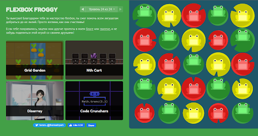

# kottans-frontend

### Hi everybody

My name is Alexey and I'm very happy to join this [Kottans/Stage 0](https://github.com/kottans/frontend/blob/2022_UA/contents.md) course for beginners. I read a couple of positive articles about kottans and wanted to join your course. I already have some experience in Front End development. From the course I want to get a lot of experience in Technical skills that will get a job

---------

## [General](https://github.com/kottans/frontend/blob/2022_UA/contents.md#general)
---

## Git Basics

My name is Alexei. I was already familiar with git and github, but as it turned out, this knowledge was superficial. So this Git course was helpful for me and learned a lot. 

----------

## Linux CLI, and HTTP

#### Linux Survival

Screenshot

 

#### Conclusion

It was very informative for me to learn Linux commands. I have long wanted to know them to use in working with the "Git Bash" console.

### HTTP Tools

[HTTP: The protocol behind the intelligence of the skin web retailer - Part 1](https://code.tutsplus.com/uk/tutorials/http-the-protocol-every-web-developer-must-know-part-1--net-31177)

[HTTP: The protocol behind the intelligence of the skin web retailer - Part 2](https://code.tutsplus.com/uk/tutorials/http-the-protocol-every-web-developer-must-know-part-2--net-31155)

#### Conclusion

These two articles were helpful to me. I learned a lot of new things that made me think about encryption and automation

---
## Git Collaboration

### [Introduction to Git and GitHub](https://learn.udacity.com/courses/ud123)

Screenshot

 

#### Conclusion

Quite an interesting course and everything is short and clear

### [Learn Git Branching](https://learngitbranching.js.org/?locale=uk)

Screenshot

 

#### Conclusion

I have acquired very useful skills in using "Git" commands and I will use this in future work. It also struck me how flexible a "Git" can be.

---

## Intro to HTML and CSS

[Intro to HTML & CSS](https://www.coursera.org/learn/html-css-javascript-for-web-developers)

Screenshot

 

#### Conclusion

The course is interesting, but here only the basics I can’t add anything else

### [Learn HTML](https://www.codecademy.com/learn/learn-html)

Screenshot

 

### [Learn CSS](https://www.codecademy.com/learn/learn-css)

Screenshot

 

#### Conclusion

A very cool site where you can not only read but also code. For me it was a good lesson to remember the forgetting of knowledge. I recommend to all beginners.

---

## Responsive Web Design

[FLEXBOX. We learn to machine on flexes](https://www.youtube.com/playlist?list=PLM6XATa8CAG5mPV60dMmjMRrHVW4LmV2x)

[Flexbox Froggy](http://flexboxfroggy.com/)

Screenshot

 

#### Conclusion

Video material in combination with a site where you can work and learn everything "Flexbox" is perfect for beginners to fix knowledge. In the future, I will definitely use this material.

[CSS Grid Layout](https://www.youtube.com/watch?v=GV92IdMGFfA&list=PLM6XATa8CAG5pXQrW_kDaeZb_uIAMNZIm)

[Grid Garden](http://cssgridgarden.com/)

Screenshot

 

#### Conclusion

The same excellent site for practicing skills after the video material has been passed. On this site, in the last task, I felt a slight difficulty and spend 15 minutes on it. I will also use "Grid layout" in the future.